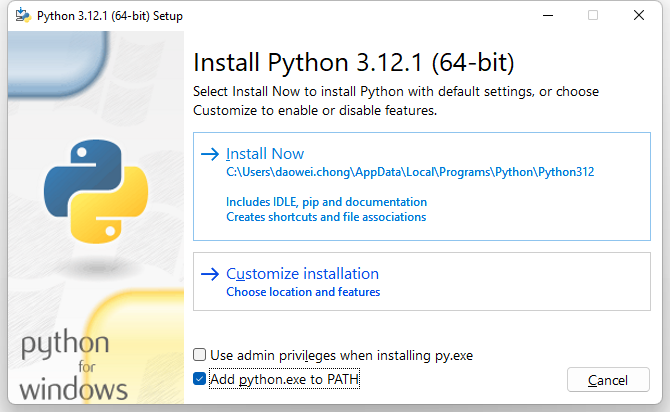
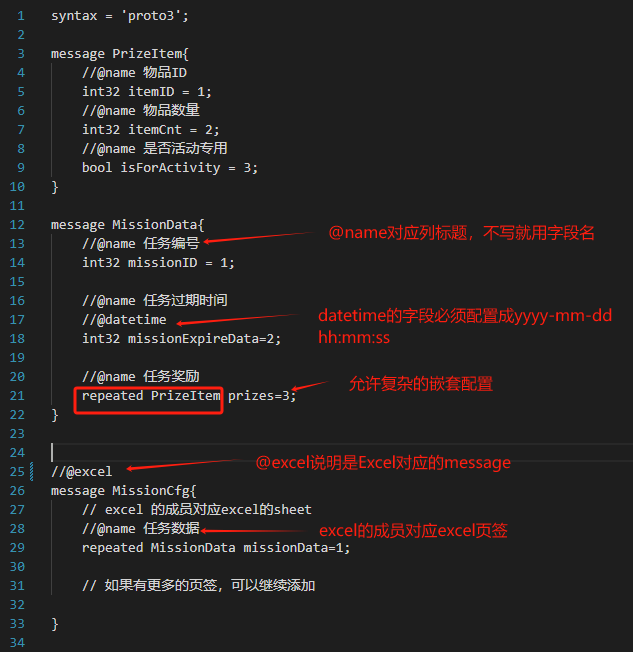
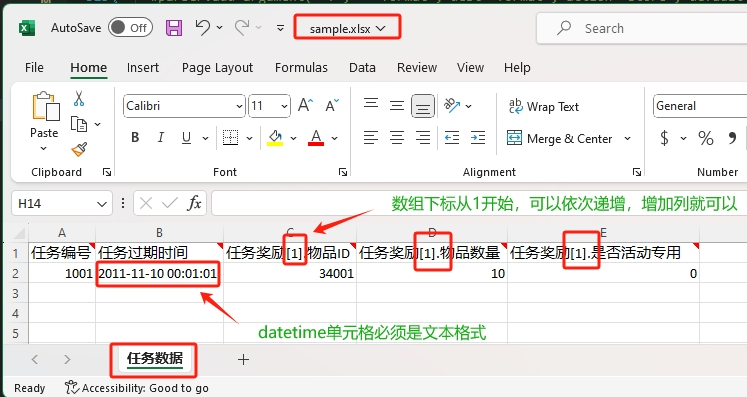

# 使用流程
1. 开发同学设计Excel格式
2. 产品同学配置excel和转换Excel
3. 发布新配置

# 使用准备
1. 安装python3， 可以下载[最新版](https://www.python.org/ftp/python/3.12.1/python-3.12.1-amd64.exe),点击安装，注意安裝的時候要 ___勾选___ "Add python.exe to PATH"。

2. pip install protobuf openpyxl

# 产品同学使用
配置完Excel后，双击gen_all_cfg.bat, 然后commit变更的配置即可

# 开发同学使用
1. 在proto目录写protobuf描述文件
2. 在tools/Config.py中配置
3. 运行gen_excel.bat生成excel
4. 在excel中增加配置
5. 运行gen_all_cfg.bat生成配置

# 工具介绍

## proto格式说明
参考tools/Config.py的配置，把proto/excel/生成文件三者关系关联起来。

```
"proto/sample.proto":
{
    "excel":"excel/sample.xlsx", 
    "serverCfg":"output/server/sample/sample.json", 
    'clientCfg':"output/client/sample/sample.json"
}
```
查看sample.proto里面的配置

- 如果某些字段只想转给服务器，就用 ***//@server***
- 如果某些字段只想转给客户端，就用 ***//@client***

生成的Excel如图所示


